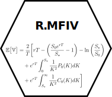
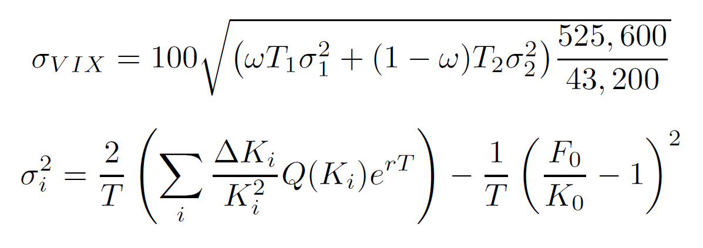

<!-- README.md is generated from README.Rmd. Please edit that file -->

```{r, include = FALSE}
knitr::opts_chunk$set(
  collapse = TRUE,
  comment = "#>",
  fig.path = "man/figures/README-",
  out.width = "100%"
)
```

# R.MFIV 

<!-- badges: start -->
[](https://travis-ci.com/m-g-h/R.MFIV)
[](https://codecov.io/gh/m-g-h/R.MFIV?branch=master)
<!-- badges: end -->

R.MFIV is currently in development. It can be installed via:
```{r, eval = FALSE}
remotes::install_github("m-g-h/R.MFIV")
```


## Package Functionality

The VIX is defined as:

```{r echo=FALSE, out.width='45%', fig.align='center'}

```

where the term in brackets under the square root is a linear interpolation of two Implied Variances, which are given by the second formula. The CBOE approach of the VIX calculation is explained in the [CBOE VIX Whitepaper](http://www.cboe.com/micro/vix/vixwhite.pdf).

In order to calculate the VIX and its individual variables, this package provides the following functionality as explained in the following sections

**1. Short Walkthrough**

- Calculate the *Risk-Free-Rate R* `interpolate_rfr()`
- Calculate the *At-The-Money Forward Price F~0~* `CBOE_F_O()`
- Calculate the *At-The-Money Strike Price K~0~* `CBOE_K_0()`
- *Select* the Option Quotes Q(K~i~) according to the CBOE Rule `CBOE_option_selection()`
- Calculate the *Implied Variance &sigma;^2^* `CBOE_sigma_sq()`
- Do all of the above in one function `CBOE_VIX_variables()`
- Interpolate the **VIX** using two Implied Variances `CBOE_VIX_index()`
- Calculate *Option Descriptives* `option_descriptives()`

**2. Processing a whole dataset (using data.table)**

- Automatically determine the *Expiration Terms* ("near-" and "next-term") `CBOE_interpolation_terms()`
- Create the implied Variance (and VIX variables) for a whole dataset
- Interpolate the weekly or monthly VIX index

**3. Visualise the VIX-Index**

- As single plot `plot_VIX()`
- Browse through plots of multiple tickers with an *interactive Shiny App* `result_browser()`

**4. Analyse the Option-Data Quality**

- Calculate Option Descriptives for the whole dataset`option_descriptives()`
- Visualise the option data quality [to be done]

**5. Improve Option-Data Quality using Smooting Methods**

- Intra- and Extrapolate option quotes `JandT_2007_smoothing_method()`
- Calculate the Jiang & Tian MFIV `JandT_2007_sigma_sq()`


## 1. Short Walkthrough 
Load exemplary package data
```{r}
library(R.MFIV)
data(option_dataset)
option_dataset
```

We select an exemplary entry for the calculation. This observation will be our "near-term" contract. Also note that `option_quotes` is a "nested" data.table itself
```{r}

t <- option_dataset$t[4]
exp <- option_dataset$exp[4]
option_quotes <- option_dataset$option_quotes[[4]]

option_quotes
```
Next we calculate the Risk-Free-Rate R
```{r}
library(lubridate)
R <- interpolate_rfr(date = as_date(t),
                     exp = exp,
                     ret_table = F)
R
```


Calculate At-The-Money Forward Price F~0~
```{r}
## Set expiration time to 4 PM
exp <- exp + hours(16)
## Calculate maturity in years
maturity <- time_length(exp-t,
                        unit = "years")
## Calculate ATM Forward
F_0 <- CBOE_F_0(option_quotes = option_quotes,
                R = R,
                maturity = maturity)
F_0
```
Calculate At-The-Money Strike price K~0~
```{r}
K_0 <- CBOE_K_0(option_quotes = option_quotes,
                F_0 = F_0)
K_0
```

Select option quotes per CBOE rule
```{r}
option_quotes <- CBOE_option_selection(option_quotes = option_quotes,
                                       K_0 = K_0)
option_quotes

```
Calculate the Implied Variance &sigma;^2^
```{r}
sigma_sq <- CBOE_sigma_sq(sel_option_quotes = option_quotes,
                          K_0 = K_0,
                          F_0 = F_0,
                          maturity = maturity,
                          R = R)
sigma_sq
```

Do the same for a second maturity, this time all at once. This observation will be our "next-term" contract.
```{r}
## Select observation 5
t2 <- option_dataset$t[5]
exp2 <- option_dataset$exp[5]
option_quotes2 <- option_dataset$option_quotes[[5]]

## Risk free rate
R2 <- interpolate_rfr(date = as_date(t2),
                      exp = exp2,
                      ret_table = F)

## Set expiration time to 4 PM
exp2 <- exp2 + hours(16)
## Calculate maturity in years
maturity2 <- time_length(exp2-t2,unit = "years")

## Calculate all VIX vars at once
VIX_vars <- CBOE_VIX_vars(option_quotes = option_quotes2,
                          R = R2,
                          maturity = maturity2,
                          ret_vars = T)

VIX_vars
```

Calculate and interpolate the VIX index from both maturities
```{r}
CBOE_VIX_index(maturity = c(maturity, maturity2),
               sigma_sq = c(sigma_sq,VIX_vars$sigma_sq))
```
Optionally calculate Option Descriptives, i.e. the strike price range and spacing in standard-deviation (SD) units of the used option quotes:
```{r}
price <- option_dataset$price[4]
option_descriptives(option_quotes = option_quotes,
                    K_0 = K_0,
                    R = R,
                    price = price,
                    maturity = maturity)
```

## 2. Processing a whole dataset (using `data.table` and `future.apply`)

To speed up the calculations, we employ parallelised versions of the `apply` family. However, you can still use the standard ones.
```{r}
library(future.apply)
plan(multisession, workers = 4) ## Parallelize using four cores
```


Determine the expiration terms for the interpolation. 1 indicates the near-term, 2 the next-term option. We only keep those observations which are relevant for the weekly and monthly VIX calculation.
```{r}
## Determine maturity
option_dataset[, maturity := time_length((exp + hours(16) - t),unit = "years")]

## Weekly and monthly expiration terms
option_dataset[, `:=`(term_wk = future_sapply(maturity, CBOE_interpolation_terms,
                                              method = "weekly",
                                              future.seed = 1337),
                      term_mn = future_mapply(CBOE_interpolation_terms,
                                              maturity, as_date(t), as_date(exp),
                                              MoreArgs = list(method = "monthly"),
                                              future.seed = 1337)
)]
## Select only options needed for the weekly and monthly VIX
option_dataset <- option_dataset[!is.na(term_wk)
                                 | !is.na(term_mn)]

option_dataset
```

Calculate the Implied Variances for a complete dataset
```{r vix dataset example}
## Calculate risk-free-rate and maturity
option_dataset[, `:=`(R = interpolate_rfr(date = as_date(t),
                                          exp = exp))]

## Calculate CBOE MFIV for the whole dataset
option_dataset[, sigma_sq := future_mapply(CBOE_VIX_vars, option_quotes, R, maturity, future.seed = 1337)
               ]
option_dataset
```

Optionally, if you want to keep the intermediate variables:
```{r}
## This function converts the mapply results below to a data.table
multicols <- function(matrix){
  data.table::as.data.table(t(matrix))[, lapply(.SD, unlist)]
}
```


```{r vix dataset example all vars}
## Calculate VIX for the whole dataset, including intermediate variables
option_dataset[, c("F_0", "K_0", "n_put_raw", "n_call_raw", "n_put", "n_call", "sigma_sq") := 
                 multicols(future_mapply(CBOE_VIX_vars,
                                         option_quotes, R, maturity,
                                         MoreArgs = list(ret_vars = T),
                                         future.seed = 1337)
                 )]
option_dataset
```


Calculate the VIX indices
```{r}
## Weekly VIX
weekly <- option_dataset[!is.na(term_wk)][, .(VIX_wk = CBOE_VIX_index(maturity = maturity,
                                                                      sigma_sq = sigma_sq)),
                                          by = .(ticker, t)]

## Monthly VIX
monthly <- option_dataset[!is.na(term_mn)][, .(VIX_mn = CBOE_VIX_index(maturity = maturity,
                                                                       sigma_sq = sigma_sq)),
                                           by = .(ticker, t)]

VIX_data <- weekly[monthly, on = .(ticker, t)]

VIX_data
```
## 3. Visualise the VIX-Index

Display the data
```{r}
plot_VIX(VIX_data)
```

**You can use `result_browser(VIX_data)` to display an interactive Shiny App that allows to browse through the results**

## 4. Analyse the Option-Data Quality
Calculate descriptive variables for the option-data quality
```{r}
## Calculate the option descriptives using the `multicols()` function from above
option_dataset[, c("SD", "max_K", "min_K", "mean_delta_K", "n_put", "n_call") := 
                 multicols(future_mapply(option_descriptives,
                                         option_quotes, K_0, R, price, maturity)
                 )]
option_dataset
```

## 5. Improve Option-Data Quality using Smooting Methods
```{r}
## Use the Jiang & Tian (2007) smoothing method to fill in and extrapolate the option quotes.
option_dataset[, option_quotes_smooth := future_mapply(JandT_2007_smoothing_method,
                                                       option_quotes, K_0, price, R, maturity, F_0,
                                                       SIMPLIFY = F)]

option_dataset
```
Let's look at one nest of smoothed `option_quotes`
```{r}
## Calculate the option descriptives using the `multicols()` function from above
smooth_quotes <- option_dataset$option_quotes_smooth[[1]]

min(smooth_quotes$K)
max(smooth_quotes$K)
length(smooth_quotes$K)
## Average spacing in price units
mean(smooth_quotes$K - data.table::shift(smooth_quotes$K), na.rm = T)

## Spacing in SD units
3 / (option_dataset$SD[[1]] * option_dataset$price[[1]] * sqrt(option_dataset$maturity[[1]]))
```

Now calculate the MFIV using the Jiang & Tian (2007) method:
```{r}
option_dataset[, sigma_sq_smooth := future_mapply(JandT_2007_sigma_sq,
                                                  option_quotes_smooth, K_0, maturity, R)]
```
Calculate the respective VIX indices
```{r}
## Weekly VIX
weekly_smooth <- option_dataset[!is.na(term_wk)][, .(VIX_wk_smooth = CBOE_VIX_index(maturity = maturity,
                                                                                    sigma_sq = sigma_sq_smooth)),
                                                 by = .(ticker, t)]

## Monthly VIX
monthly_smooth <- option_dataset[!is.na(term_mn)][, .(VIX_mn_smooth = CBOE_VIX_index(maturity = maturity,
                                                                                     sigma_sq = sigma_sq_smooth)),
                                                  by = .(ticker, t)]

VIX_data_smooth <- weekly_smooth[monthly_smooth, on = .(ticker, t)]

VIX_data_2 <- VIX_data[VIX_data_smooth, on = .(ticker, t)]

plot_VIX(data = VIX_data_2,
         VIX_vars = c("VIX_wk", "VIX_mn",
                      "VIX_wk_smooth", "VIX_mn_smooth"))
```
