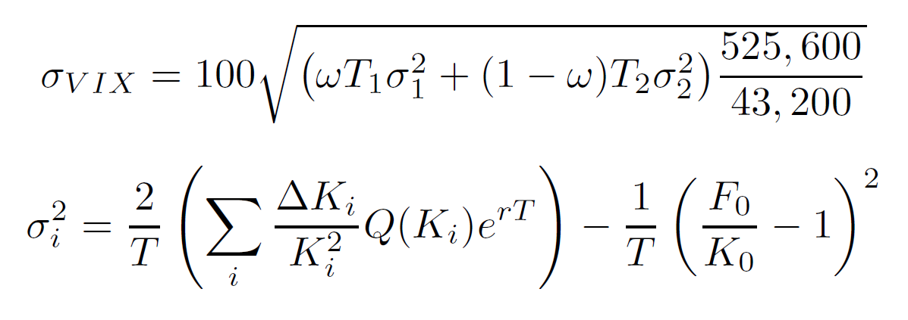

<!-- README.md is generated from README.Rmd. Please edit that file -->

# R.MFIV

<!-- badges: start -->

[](https://travis-ci.com/m-g-h/R.MFIV)
[](https://codecov.io/gh/m-g-h/R.MFIV?branch=master)
<!-- badges: end -->

R.MFIV is currently in development

## CBOE VIX Calculation

The approach of the VIX calculation, which is replicated below, is
explained in the [CBOE VIX
Whitepaper](http://www.cboe.com/micro/vix/vixwhite.pdf).

The VIX is defined as:



where the term in brackets under the square root is a linear
interpolation of two Implied Variances, which are given by the second
formula.

In order to calculate the VIX and its individual variables, this package
provides the following functionality:

1.  Calculate the Risk-Free-Rate R `interpolate_rfr()`
2.  Calculate the At-The-Money Forward Price F<sub>0</sub> `CBOE_F_O()`
3.  Calculate the At-The-Money Strike Price K<sub>0</sub> `CBOE_K_0()`
4.  Select the Option Quotes Q(K<sub>i</sub>) according to the CBOE Rule
    `CBOE_option_selection()`
5.  Calculate the Implied Variance σ<sup>2</sup> `CBOE_sigma_sq()`
6.  Do all of the above in one function `CBOE_VIX_variables()`
7.  Determine the Expiration Terms (“near-” and “next-term”)
    `CBOE_interpolation_terms()`
8.  Interpolate the VIX using two Implied Variances `CBOE_VIX_index()`
9.  Calculate Option Descriptives `option_descriptives()`
10. Display the data
      - As single plot `pot_VIX()`
      - In an interactive Shiny App `result_browser()`

## 1\. Short Walkthrough

Load exemplary package data

``` r
library(R.MFIV)
data(option_dataset)
option_dataset
#>        ticker                   t        exp   price       option_quotes
#>     1:   AAAA 2017-06-13 09:31:00 2017-06-16 147.390  <data.table[96x3]>
#>     2:   AAAA 2017-06-13 09:31:00 2017-06-23 147.390  <data.table[60x3]>
#>     3:   AAAA 2017-06-13 09:31:00 2017-06-30 147.390  <data.table[53x3]>
#>     4:   AAAA 2017-06-13 09:31:00 2017-07-07 147.390  <data.table[51x3]>
#>     5:   AAAA 2017-06-13 09:31:00 2017-07-14 147.390  <data.table[40x3]>
#>    ---                                                                  
#> 12866:   BBBB 2017-06-13 16:00:00 2017-12-15 980.805  <data.table[91x3]>
#> 12867:   BBBB 2017-06-13 16:00:00 2018-01-19 980.805 <data.table[139x3]>
#> 12868:   BBBB 2017-06-13 16:00:00 2018-06-15 980.805  <data.table[71x3]>
#> 12869:   BBBB 2017-06-13 16:00:00 2018-09-21 980.805  <data.table[65x3]>
#> 12870:   BBBB 2017-06-13 16:00:00 2019-01-18 980.805 <data.table[117x3]>
```

We select an exemplary entry as an example. This observation will be our
“near-term” contract. Also note that `option_quotes` is a “nested”
data.table itself

``` r

t <- option_dataset$t[4]
exp <- option_dataset$exp[4]
option_quotes <- option_dataset$option_quotes[[4]]

option_quotes
#>         K      c      p
#>  1: 105.0 42.550     NA
#>  2: 110.0 37.550     NA
#>  3: 115.0 32.525     NA
#>  4: 120.0 27.600     NA
#>  5: 123.0 24.600  0.105
#>  6: 124.0 23.600  0.115
#>  7: 125.0 22.675  0.135
#>  8: 126.0 21.650  0.155
#>  9: 127.0 20.725  0.170
#> 10: 128.0 19.725  0.195
#> 11: 129.0 18.725  0.220
#> 12: 130.0 17.825  0.245
#> 13: 131.0 16.775  0.285
#> 14: 132.0 15.825  0.325
#> 15: 133.0 14.875  0.370
#> 16: 134.0 13.925  0.425
#> 17: 135.0 12.975  0.485
#> 18: 136.0 11.975  0.560
#> 19: 137.0 11.150  0.640
#> 20: 138.0 10.325  0.750
#> 21: 139.0  9.450  0.870
#> 22: 140.0  8.550  1.020
#> 23: 141.0  7.625  1.185
#> 24: 142.0  6.825  1.390
#> 25: 143.0  6.150  1.630
#> 26: 144.0  5.425  1.895
#> 27: 145.0  4.675  2.235
#> 28: 146.0  4.125  2.590
#> 29: 147.0  3.525  3.000
#> 30: 148.0  3.045  3.475
#> 31: 149.0  2.545  4.000
#> 32: 150.0  2.130  4.575
#> 33: 152.5  1.280  6.375
#> 34: 155.0  0.745  8.275
#> 35: 157.5  0.430 10.450
#> 36: 160.0  0.265 12.800
#> 37: 162.5  0.165 15.175
#> 38: 165.0  0.115 17.650
#> 39: 167.5  0.085 20.100
#> 40: 170.0     NA 22.600
#> 41: 172.5     NA 25.075
#> 42: 175.0     NA 27.575
#> 43: 177.5     NA 30.075
#> 44: 180.0     NA 32.575
#> 45: 182.5     NA 35.075
#> 46: 185.0     NA 37.575
#> 47: 187.5     NA 40.075
#> 48: 190.0     NA 42.575
#> 49: 195.0     NA 47.575
#> 50: 200.0     NA 52.575
#> 51: 210.0     NA 62.575
#>         K      c      p
```

Next we calculate the Risk-Free-Rate R

``` r
library(lubridate)
#> 
#> Attaching package: 'lubridate'
#> The following objects are masked from 'package:base':
#> 
#>     date, intersect, setdiff, union
R <- interpolate_rfr(date = as_date(t),
                     exp = exp,
                     ret_table = F)
R
#> [1] 0.008769736
```

Calculate At-The-Money Forward Price F<sub>0</sub>

``` r
## Set expiration time to 4 PM
exp <- exp + hours(16)
## Calculate maturity in years
maturity <- time_length(exp-t,
                        unit = "years")
## Calculate ATM Forward
F_0 <- CBOE_F_0(option_quotes = option_quotes,
                R = R,
                maturity = maturity)
F_0
#> [1] 147.5697
```

Calculate At-The-Money Strike price K<sub>0</sub>

``` r
K_0 <- CBOE_K_0(option_quotes = option_quotes,
                F_0 = F_0)
K_0
#> [1] 147
```

Select option quotes per CBOE rule

``` r
option_quotes <- CBOE_option_selection(option_quotes = option_quotes,
                                       K_0 = K_0)
option_quotes
#>         K      c      p
#>  1: 123.0 24.600  0.105
#>  2: 124.0 23.600  0.115
#>  3: 125.0 22.675  0.135
#>  4: 126.0 21.650  0.155
#>  5: 127.0 20.725  0.170
#>  6: 128.0 19.725  0.195
#>  7: 129.0 18.725  0.220
#>  8: 130.0 17.825  0.245
#>  9: 131.0 16.775  0.285
#> 10: 132.0 15.825  0.325
#> 11: 133.0 14.875  0.370
#> 12: 134.0 13.925  0.425
#> 13: 135.0 12.975  0.485
#> 14: 136.0 11.975  0.560
#> 15: 137.0 11.150  0.640
#> 16: 138.0 10.325  0.750
#> 17: 139.0  9.450  0.870
#> 18: 140.0  8.550  1.020
#> 19: 141.0  7.625  1.185
#> 20: 142.0  6.825  1.390
#> 21: 143.0  6.150  1.630
#> 22: 144.0  5.425  1.895
#> 23: 145.0  4.675  2.235
#> 24: 146.0  4.125  2.590
#> 25: 147.0  3.525  3.000
#> 26: 148.0  3.045  3.475
#> 27: 149.0  2.545  4.000
#> 28: 150.0  2.130  4.575
#> 29: 152.5  1.280  6.375
#> 30: 155.0  0.745  8.275
#> 31: 157.5  0.430 10.450
#> 32: 160.0  0.265 12.800
#> 33: 162.5  0.165 15.175
#> 34: 165.0  0.115 17.650
#> 35: 167.5  0.085 20.100
#>         K      c      p
```

Optionally calculate the Implied Variance σ<sup>2</sup>

``` r
sigma_sq <- CBOE_sigma_sq(sel_option_quotes = option_quotes,
                          K_0 = K_0,
                          F_0 = F_0,
                          maturity = maturity,
                          R = R)
sigma_sq
#> [1] 0.05416683
```

Do the same for a second maturity, this time all at once. This
observation will be our “next-term” contract.

``` r
## Select observation 5
t2 <- option_dataset$t[5]
exp2 <- option_dataset$exp[5]
option_quotes2 <- option_dataset$option_quotes[[5]]

## Risk free rate
R2 <- interpolate_rfr(date = as_date(t2),
                      exp = exp2,
                      ret_table = F)

## Set expiration time to 4 PM
exp2 <- exp2 + hours(16)
## Calculate maturity in years
maturity2 <- time_length(exp2-t2,unit = "years")

## Calculate all VIX vars at once
VIX_vars <- CBOE_VIX_vars(option_quotes = option_quotes2,
                          R = R2,
                          maturity = maturity2,
                          ret_vars = T)

VIX_vars
#> $F_0
#> [1] 147.5497
#> 
#> $K_0
#> [1] 147
#> 
#> $n_put_raw
#> [1] 15
#> 
#> $n_call_raw
#> [1] 14
#> 
#> $n_put
#> [1] 15
#> 
#> $n_call
#> [1] 14
#> 
#> $sigma_sq
#> [1] 0.05222205
```

Calculate and interpolate the VIX index from both maturities

``` r
CBOE_VIX_index(maturity = c(maturity, maturity2),
               sigma_sq = c(sigma_sq,VIX_vars$sigma_sq))
#> [1] 22.91347
```

Calculate Option Descriptives, i.e. the strike price range and spacing
in standard-deviation (SD) units of the used option quotes:

``` r
price <- option_dataset$price[4]
option_descriptives(option_quotes = option_quotes,
                    K_0 = K_0,
                    R = R,
                    price = price,
                    maturity = maturity)
#> $SD
#> [1] 0.2218317
#> 
#> $max_K
#> [1] 167.5
#> 
#> $min_K
#> [1] 123
#> 
#> $mean_delta_K
#> [1] 1.308824
#> 
#> $n_put
#> [1] 24
#> 
#> $n_call
#> [1] 10
```

## 2\. Processing a whole dataset (using data.table)

Calculate the Implied Variances for a complete dataset

``` r
## Calculate risk-free-rate and maturity
option_dataset[, `:=`(R = interpolate_rfr(date = as_date(t),
                                          exp = exp),
                      maturity = time_length((exp + hours(16) - t),unit = "years"))]

## Calculate VIX for the whole dataset
option_dataset[, sigma_sq := mapply(CBOE_VIX_vars, option_quotes, R, maturity)]
option_dataset
#>        ticker                   t        exp   price       option_quotes
#>     1:   AAAA 2017-06-13 09:31:00 2017-06-16 147.390  <data.table[96x3]>
#>     2:   AAAA 2017-06-13 09:31:00 2017-06-23 147.390  <data.table[60x3]>
#>     3:   AAAA 2017-06-13 09:31:00 2017-06-30 147.390  <data.table[53x3]>
#>     4:   AAAA 2017-06-13 09:31:00 2017-07-07 147.390  <data.table[51x3]>
#>     5:   AAAA 2017-06-13 09:31:00 2017-07-14 147.390  <data.table[40x3]>
#>    ---                                                                  
#> 12866:   BBBB 2017-06-13 16:00:00 2017-12-15 980.805  <data.table[91x3]>
#> 12867:   BBBB 2017-06-13 16:00:00 2018-01-19 980.805 <data.table[139x3]>
#> 12868:   BBBB 2017-06-13 16:00:00 2018-06-15 980.805  <data.table[71x3]>
#> 12869:   BBBB 2017-06-13 16:00:00 2018-09-21 980.805  <data.table[65x3]>
#> 12870:   BBBB 2017-06-13 16:00:00 2019-01-18 980.805 <data.table[117x3]>
#>                  R    maturity   sigma_sq
#>     1: 0.008325593 0.008953152 0.11121384
#>     2: 0.008476933 0.028118108 0.07567317
#>     3: 0.008624972 0.047283063 0.06428081
#>     4: 0.008769736 0.066448019 0.05416683
#>     5: 0.008911253 0.085612974 0.05222205
#>    ---                                   
#> 12866: 0.011223245 0.506502396 0.06804466
#> 12867: 0.011519671 0.602327173 0.06671541
#> 12868: 0.012206451 1.004791239 0.07255222
#> 12869: 0.012604115 1.273100616 0.07305354
#> 12870: 0.013144595 1.598904860 0.07445219
```

If you want to keep the intermediate variables:

``` r
var_names <- c("F_0", "K_0", "n_put_raw", "n_call_raw", "n_put", "n_call", "sigma_sq")

## Function to convert the mapply result to a data.table
multicols <- function(matrix){
  data.table::as.data.table(t(matrix))[, lapply(.SD, unlist)]
}

## Calculate VIX for the whole dataset, including intermediate variables
option_dataset[, c("F_0", "K_0", "n_put_raw", "n_call_raw", "n_put", "n_call", "sigma_sq") := 
                 multicols(mapply(CBOE_VIX_vars,
                                  option_quotes, R, maturity,
                                  MoreArgs = list(ret_vars = T))
                 )]
option_dataset
```

Determine the expiration terms for the interpolation. 1 indicates the
near-term, 2 the next-term option.

``` r
## Weekly expiration terms
option_dataset[, `:=`(term_wk = sapply(maturity, CBOE_interpolation_terms,
                                       method = "weekly"),
                      term_mn = mapply(CBOE_interpolation_terms,
                                       maturity, as_date(t), as_date(exp),
                                       MoreArgs = list(method = "monthly"))
)]
```

Calculate the VIX indices

``` r
## Weekly VIX
weekly <- option_dataset[!is.na(term_wk)][, .(VIX_wk = CBOE_VIX_index(maturity = maturity,
                                                                      sigma_sq = sigma_sq)),
                                          by = .(ticker, t)]

## Monthly VIX
monthly <- option_dataset[!is.na(term_mn)][, .(VIX_mn = CBOE_VIX_index(maturity = maturity,
                                                                       sigma_sq = sigma_sq)),
                                           by = .(ticker, t)]

VIX_data <- weekly[monthly, on = .(ticker, t)]

VIX_data
#>      ticker                   t   VIX_wk   VIX_mn
#>   1:   AAAA 2017-06-13 09:31:00 22.91347 21.45530
#>   2:   AAAA 2017-06-13 09:32:00 22.84365 21.17519
#>   3:   AAAA 2017-06-13 09:33:00 22.78820 21.13499
#>   4:   AAAA 2017-06-13 09:34:00 22.75515 21.11951
#>   5:   AAAA 2017-06-13 09:35:00 22.75988 21.05913
#>  ---                                             
#> 776:   BBBB 2017-06-13 15:56:00 21.46799 18.35661
#> 777:   BBBB 2017-06-13 15:57:00 21.45854 18.36722
#> 778:   BBBB 2017-06-13 15:58:00 21.44498 18.38045
#> 779:   BBBB 2017-06-13 15:59:00 21.50976 18.45417
#> 780:   BBBB 2017-06-13 16:00:00 21.60340 18.07499
```

Display the data

``` r
plot_VIX(VIX_data)
```


You can use `result_browser(VIX_data)` to display an interactive Shiny
App that allows to browse through the results
